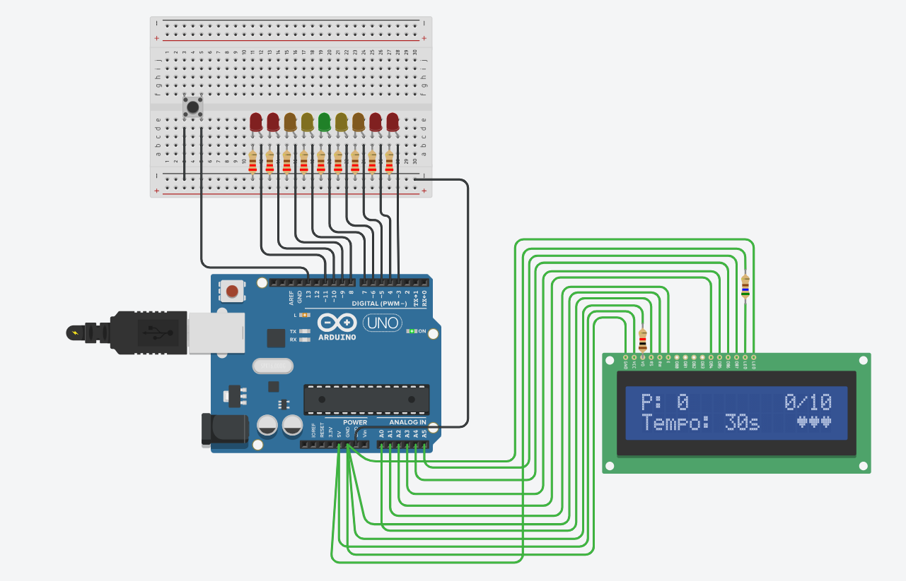

# Roleta de LEDs

> Projeto interdisciplinar

### Informações do projeto:

* Universidade do Extremo Sul Catarinense (UNESC);
* Curso de Ciência da Computação;
* Segunda fase;
* Projeto interdisciplinar envolvendo as disciplinas:
  * Laboratório de Programação;
  * Sistemas Digitais;
  * Funções e Derivadas;
  * Design de Interação;
* Grupo:
  * Caio Vinícius Guimarães de Oliveira Dagostim;
  * Emanuel Cardoso Tavecia;
  * Gabriel Alves Teixeira;
  * Guilherme Conti Machado;

### Circuito:

